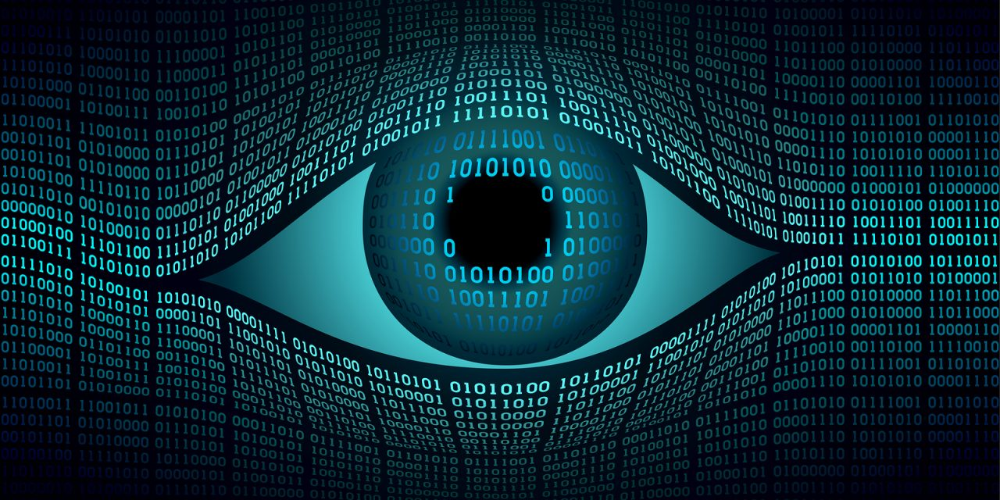

# Computer Vision
### Python

Computer Vision is a sub-area of ​​Artificial Intelligence responsible for creating systems capable of processing, analyzing and identifying visual data in a human-like way. There are many commercial applications in various areas, such as: security, marketing, decision making and production. Smartphones use computer vision to unlock cell phones using facial recognition, autonomous cars can detect pedestrians and maintain a safe distance from other vehicles and security cameras identify whether there are people in the environment to trigger an alarm. These are just a few examples of commercial applications in this area.  
[Recursos](https://drive.google.com/drive/folders/1EUdRpr5YXNgffO9qg4pY0243__Tz5PQC)